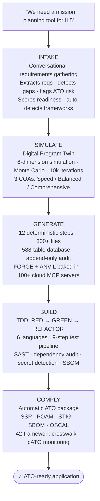
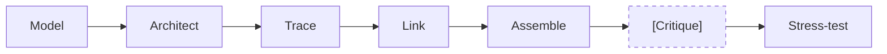
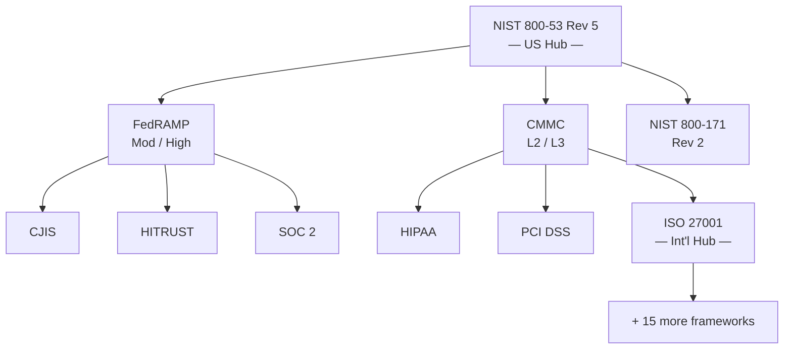
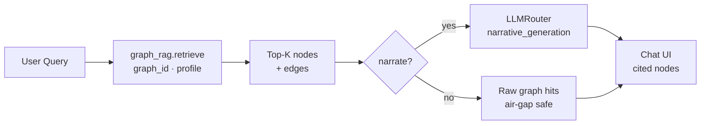
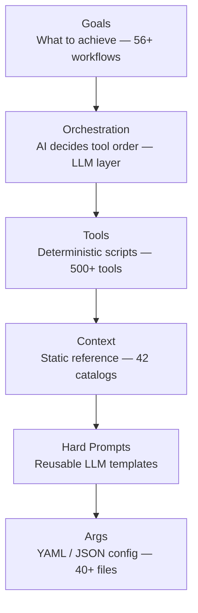
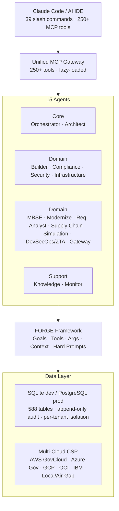

<p align="center">
  <a href="https://github.com/icdev-ai/icdev/stargazers"></a>
  <a href="https://github.com/icdev-ai/icdev/network/members"></a>
</p>

<p align="center">
  
  
  
  <a href="https://pypi.org/project/icdev/"></a>
  <a href="https://pypi.org/project/icdev/"></a>
  
  
  
  
  
  
  <a href="https://github.com/icdev-ai/icdev/issues"></a>
  <a href="https://github.com/icdev-ai/icdev/actions"></a>
</p>

# ICDEV™ — Intelligent Certified Development Platform

**A system that builds systems.**

> **DISCLAIMER:** This repository does NOT contain classified or Controlled Unclassified Information (CUI). Terms like "CUI", "SECRET", "IL4", "IL5", "IL6" appear throughout as **configuration values and template strings** — not as indicators that this repository itself is classified. Classification terminology references publicly available U.S. government standards ([EO 13526](https://www.archives.gov/isoo/policy-documents/cnsi-eo.html), [32 CFR Part 2002](https://www.ecfr.gov/current/title-32/subtitle-B/chapter-XX/part-2002), [NIST SP 800-53](https://csrc.nist.gov/publications/detail/sp/800-53/rev-5/final)). File headers containing `[TEMPLATE: CUI // SP-CTI]` are **template markers** demonstrating the format ICDEV™ applies to generated artifacts.

---

## Table of Contents

- [What's New](#whats-new-in-1237--icdev-cortex-unified-governed-ai-facade--kanban-governed-delivery-pipeline)
- [What ICDEV™ Builds](#what-icdev-builds)
- [10 Design Canvases](#10-design-canvases)
- [Quick Start](#quick-start)
- [FORGE Framework](#how-it-actually-works)
- [Ask Any Canvas](#ask-any-canvas)
- [Network Design Canvas](#network-design-canvas)
- [Agentic AI Design Canvas](#agentic-ai-design-canvas)
- [FathomDesk — Trading Intelligence](#fathomdesk--ai-powered-trading-intelligence)
- [FORGE Academy](#forge-academy)
- [AI GameDay](#ai-gameday)
- [SaaS & Multi-Tenancy](#saas--portal)
- [MCP Server Integration](#mcp-server-integration)
- [Security](#security)
- [Deployment](#deployment)
- [Testing](#testing)
- [Project Structure](#project-structure)
- [License](#license)

---

## What's New in 1.2.37 — ICDEV Cortex: Unified Governed AI Facade & Kanban Governed Delivery Pipeline

- **ICDEV Cortex — one governed entrypoint for all AI.** A new facade — `cortex.complete() / reason() / search() / extract() / classify() / govern()` — sits over the LLM router, RAG, KG, DIC, and IQE. Every call is policy-routed, token-accounted end-to-end (result → audit → metrics), and can fail closed on a governance violation (`governance.fail_closed` is now live, not dead config). Cross-backend search merges results with Reciprocal Rank Fusion; an opt-in in-process response cache (LRU + TTL) is audited and tenant-safe. Governed Chain-of-Thought / debate / council reasoning is exposed over REST, and a governance-first home monitor card surfaces usage and spend over `cortex_audit`.
- **Cortex external exposure — scoped service keys + DataBridge connectors.** External services can consume Cortex through scoped service keys and a client SDK. New DataBridge connectors expose `icdev_cpmp` (contract/delivery bridge, including `cpars_assessments` + `negative_events` and a `mod_recommendations` write path) and `icdev_demand` (RFI demand signals) to workforce tools; a RICOAS intake bridge lands at `/cortex/api/v1/intake/*`, and a won bid can propose the `/cpmp` delivery baseline via the award endpoint.
- **Policy-routed LLM — the content decides whether a call may leave the host.** Pillar-0 egress policy classifies request content and keeps CUI / local-only chains on-host while allowing cloud models for releasable content. Playwright / e2e execution chains are centralized on the configured test-execution provider.
- **Kanban Governed Delivery Pipeline — repo-aware dispatch + gate integrity.** External-repo (`prem-*`) tasks now build **into** their target repo instead of churning against ICDEV's tree-scoped gates; a task is *done* only when its work **landed** on that repo's `origin/main`, and bypass can't skip the gate. Manual-mode gate tasks are exempt from the reaper, startup recovery, and the backlog→scheduled promoter — closing the four paths that previously released (then erased) gated work. The worktree sweeper no longer reports removals it never performed, the two never-populated board columns are wired, a Manual Build checkbox + build-model selector were added, and 76 failing kanban tests were repaired alongside 3 real schema/production bugs.
- **GovCon PTW — real prices, real people, cited win themes.** A bid-side LCAT→person registry, auditable pricing that a win carries into `/cpmp` (a zero rate is treated as real data, not missing), win-theme intake that actually shapes the draft, and a PTW-posture Council consult; `specialist_consult` now fails closed. A whole BI dashboard can finally be exported.
- **Housekeeping.** Employer identity removed from the repo (no company name in ICDEV); a dashboard fix where an unescaped apostrophe had killed every function on the home page; the CI lint gate no longer auto-`--fix`es away lint debt.

---

## What's New in 1.2.36 — Security Fix: ABAC Need-to-Know & Canvases Discoverable After `pip install`

- **Security — ABAC ownership enforcement (fail-open fix).** Attribute references like `${subject.user_id}` were resolved against a *flattened* context, so the dotted path never resolved and yielded `None` — which the matcher treats as match-all. Because evaluation is first-match-wins and `proposal_section_writer_own` (Permit) precedes `proposal_section_writer_deny_unassigned` (Deny), any `section_writer` could edit **any** proposal section, not just their own. References now resolve against a nested context, and an unresolvable reference becomes a sentinel that can never match — so evaluation falls through to deny (fail-closed). Ownership scoping on `developer_readwrite_own` was affected the same way. **Upgrade if you rely on ABAC need-to-know.**
- **Canvases are discoverable after `pip install`.** `icdev init` seeds a project's `.env` from the packaged template, which was missing ~90 capability flags — so Document Intelligence, Tech Writer, Notebook, Slides, and the RFI canvas were invisible on a fresh install even though the code shipped. The template now documents **62/62** registry-declared enablement flags, and two new release gates (`env_files_sync`, `env_flags_documented`) keep it from drifting again. (Already-installed users can run `icdev enable dic` today — it reads the registry directly.)
- **DIC AI Assist no longer silently abstains.** A single transient empty completion from a cloud model left the section blank with no feedback. Empty completions are now retried (bounded), the per-attempt timeout is configurable and more generous, and an abstention is surfaced to the reviewer instead of silently reloading.
- **Schema completeness.** `rag_queries` / `rag_citations` are materialized in the PG schema and init (the RAG result-card renderer already queried them), and `tenant_id` / `classification` RLS columns were added to `pg_pwin_assessments`, `pg_competitor_awards`, and `pg_capture_gate_decisions`, which previously raised `UndefinedColumn` on every read.

---

## What's New in 1.2.35 — TRUST: Anti-Hallucination Citations, Provenance & Fail-Closed Data Masking

The **TRUST** initiative makes everything ICDEV™ generates cite its sources with real data provenance, and enforces data masking across the ecosystem.

- **Universal source citations + provenance** — Everything ICDEV™ generates (proposals, RFI responses, DIC documents, Tech Writer drafts, and generated child apps) now carries inline `[source:]` citations validated against its evidence, with a blocking `citation_guard` on promote/export (HITL `force_*` override + audit, mirroring `placeholder_guard`). Built on a shared `tools/quality/citation_grounding.py` core; per-artifact provenance is backed by the materialized `rag_provenance_ledger`.
- **Fail-closed data masking** — LLM egress can abort (`RedactionUnavailableError`) rather than send raw PII/CUI when the sanitizer is unavailable (`redaction.fail_closed`); ingestion-time masking (`redaction.mask_at_ingestion`) anonymizes content before it reaches the vector store; a scheduled `redaction_scan_reflex` files `[PII-SCAN]` remediation cards for unmasked data at rest. All toggles default off for safe rollout.
- **Anti-hallucination consistency** — the deterministic confabulation detector (fabricated-citation patterns, contradictions, hedging) is wired into RFI, proposals, and DIC generation as a non-blocking reviewer signal, complementing DIC's verifier + abstention. Every AI-generated draft is HITL-gated — labeled `ai_generated` and promoted only by a human approver, never auto-published.
- **Coherence gate** — `coherence_checker.check_trust_coverage` enforces that the grounding modules ship in both package trees, child apps inherit them, and the redaction toggles are present.

---

## What's New in 1.2.34 — BI Dashboard Canvas & Rubric-Gated Agent Loop

- **BI Dashboard Canvas** — NL-driven 2D/3D chart canvas at `/bi_dashboard`: describe a chart in plain English and get a rendered 2D or 3D visualization (bar, scatter3d, surface3d, bar3d) backed by real project data via a ported VIZ kernel + ECharts-gl. Two new ACE Quick Launch presets (`bi_build_dashboard`, `bi_kg_insights`).
- **Rubric-Gated Agent Loop** — `run_agent_loop_with_rubric()` in `icdev/tools/llm/agent_loop.py` declares a rubric up front, runs the agent loop, then has a separate tool-free grader LLM judge the result (satisfied / needs_revision / failed); on `needs_revision` the grader's feedback is injected and the loop resumes from the existing transcript for up to `max_grading_iterations` rounds. Framework-agnostic adaptation of deepagents' RubricMiddleware pattern — no LangGraph dependency. 12 new tests.
- **Config Hygiene Sweep** — repo-wide `args/*.yaml` sweep removed several silent duplicate-mapping-key landmines (`llm_config.yaml`, `genesis_config.yaml`, `security_gates.yaml`, `simulation_canvas_registry.yaml`) and fixed a real YAML indentation parse error in `package_exclusions.yaml` that had been breaking the installer's exclusion loader outright.

### Fixed
- **BI Dashboard bar3d aggregation** — `_structure_to_spec()` treated bar3d's categorical x/y fields (e.g. region/quarter) as raw floats, silently dropping every row; now builds `x_categories`/`y_categories` from real column values and aggregates z per (x, y) pair per the ECharts `bar3D` contract.
- **Coherence checker nav-link false positive** — `check_new_page_completeness`'s nav-link check only recognized hardcoded `href="/<canvas>"` strings, false-positiving on registry-driven canvases (`component_registry.yaml` → `nav_tree`) that render their link dynamically. The check is now registry-aware.
- **Untrusted SVG parsing (Bandit B314)** — `tools/viz/svg_to_pptx.py` now parses SVG input via `defusedxml` instead of stdlib `xml.etree.ElementTree`.

- **RFI Response Engine** — Full GovCon RFI Response Workbench canvas at `/rfi` with HITL review, WriteGuard V&V, cross-section consistency checking, deadline countdown, and one-click "Generate Why Us" narrative. New ACE evaluator team (`rfi_researcher`, `rfi_writer`, `rfi_compliance_reviewer`, `rfi_editor`, `rfi_reviewer`) under `args/ace/roles/`. 104 tests.
- **Slides: SVG → Native PPTX Shapes** — `tools/viz/svg_to_pptx.py` parses a deterministic SVG subset (rect/circle/ellipse/line/polyline/polygon/path/text, nested `<g transform>`) into native `python-pptx` `FreeformBuilder` vector shapes instead of rasterized pictures, with curves flattened to line segments. New `slide_type="svg_art"` in `pptx_builder`.
- **Slides: Template-Fill Workflow** — `tools/slides/template_fill.py` adds `/slides/templates`: upload a customer-supplied `.pptx`, inspect its fillable shapes (title/body/table/chart), and fill selected slides in place — format-preserving, no LLM step, deletes unselected slides. New `slides_templates` table.
- **Slides Schema Fix** — resolved a dialect-mismatch bug where `SERIAL PRIMARY KEY` silently landed on a SQLite-backed connection whenever PostgreSQL was unreachable, breaking autoincrement across the Slides canvas.

---

## What's New in 1.2.31 — Enterprise-Configurable Platform, ACE File Access Broker & Processify Canvas

- **Enterprise-Configurable Platform** — Component registration is now 100% registry-driven. Canvases, child apps, and features are declared in `args/component_registry.yaml`; no changes to `app.py`, `enable.py`, or `base.html` required to add a new component. Core profiles (`args/core_profiles.yaml`) let operators apply environment presets with `icdev profile apply <name>`. Tenant-level enablement overrides land in `tenant_component_overrides` (migration 207); every change is logged to the append-only `component_audit_log` (migration 208).
- **ACE File Access Broker** — `icdev/tools/ace/file_access_broker.py` enforces three-tier file access for co-worker agents: `zero_access` (`.env`, `*.pem`, `*.tfstate`), `read_only` (lock files, compliance catalogs), `no_delete` (`CLAUDE.md`, goals, IaC). Requests outside policy are blocked at execution time with an audit entry.
- **ACE Skill Promoter & Soul Manager** — `skill_promoter.py` autonomously proposes new skills derived from co-worker discoveries and queues them for human review. `soul_manager.py` manages SOUL personality configs per co-worker role, enabling per-role tone, vocabulary, and risk posture.
- **ACE Agent Coordination** — `agent_coordination.py` + migration 222 bring cross-session advisory locks so concurrent co-worker and kanban agents negotiate file ownership rather than stomping each other. Coordination state is persisted and visible in the HITL dashboard.
- **Agent Loop Persistence** — Migrations 220 (`agent_loop_sessions`) and 221 (`agent_hitl_pending`) give the reusable `run_agent_loop` primitive durable session state: loop resume on restart, HITL item queue with approver assignments, and cost/token tracking per session.
- **Processify Canvas** — New BPMN-style process design canvas at `/processify`. Drag-and-drop swimlane editor with BPMN 2.0 primitives (tasks, gateways, events, pools), JSON export, compliance overlay (maps lanes to NIST 800-53 process controls), and IQE query support.
- **Canvas Health Dashboard** — `tools/dashboard/templates/canvas_health/` delivers a real-time health panel for all registered canvases: record counts, last-indexed timestamp, IQE adapter status, missing ACE roles, and pending HITL items.
- **Updates Feed** — `tools/dashboard/templates/updates/` provides a system-wide chronological feed of component config changes, migration runs, and reflex activity — visible from the main nav under **Updates**.
- **Coworker HITL Workflow** — `templates/coworker/hitl.html` exposes a dedicated HITL queue UI: approve/reject/comment on co-worker decisions with full audit trail, priority ranking, and bulk-action support.
- **Billing Module** — `icdev/tools/billing/` adds tenant billing and subscription management: usage metering (API calls, LLM tokens, storage), tier enforcement, invoice generation, and a billing dashboard at `/billing`.
- **Onboarding Wizard** — New first-run experience (`onboarding.js` + `_onboarding_wizard.html`): 5-step guided setup covers DB backend, LLM provider, first canvas selection, profile application, and dashboard tour. Triggered automatically on fresh installs; re-launchable from Settings.
- **Migration Topology Visualization** — `migration-topology.js` renders an interactive Sankey-style migration wave diagram at `/migration/topology` — shows workloads, target environments, estimated risk bands, and STIG compliance readiness per wave.
- **Network Topology Neighbors** — Migration 218 adds `net_topology_neighbors` table with pre-computed neighbor sets for O(1) blast-radius lookup. `blueprint_helpers.py` updated to use the materialized neighbor index rather than graph traversal at query time.
- **Capability Sheet Reflex** — `icdev/tools/genesis/reflexes/capability_sheet_reflex.py` runs on a 6-hour cadence, auto-generating and updating the `.agents/skills/icdev-capability-sheet` from current tool manifests, MCP registrations, and canvas inventory. Always reflects the live platform state.
- **CMMI L3 Assessor Hardening** — `cmmi_l3_assessor.py` updated with refined evidence-weight scoring for PA 3.1–3.6, automatic detection of process asset library gaps, and a new HTML evidence report template.
- **Canvas Auto-Remediation Improvements** — `auto_remediate.py` now triggers on IQE scan findings in addition to drift-detector alerts. Confidence threshold for auto-apply raised to 0.75; sub-threshold findings surface as HITL items in the new HITL queue UI.
- **Lint Clean (264 fixes)** — Ruff auto-fix resolved 264 style and correctness issues across 128 files; all CI lint gates green.

---

## What's New in 1.2.30 — ACE Co-Worker Hardening, AAC Agent Readiness & Kanban PR Flow

- **ACE Co-Worker Engine — 14 New Roles** — 14 production roles added across 4 domains: monitoring/observability (performance_monitor, reliability_engineer, incident_responder, log_analyst, alert_manager), GovCon (govcon_specialist, capture_manager, proposal_coordinator), CPMP (contract_manager, program_analyst, deliverable_tracker), and FathomDesk (support_engineer, knowledge_curator, escalation_manager). Co-worker intent now classified via LLM + catalog constraint for automatic role assembly.
- **ACE Hardening & Traceability** — Activity timeline, trust leaderboard, and audit API shipped at `/coworker/<id>/timeline`. Step executor hardened with type safety and error surfacing. Pre-insert pending row on launch eliminates 404 race condition. `listen_topics` guard prevents circular deadlocks. Coherence gate added: `canvas_placeholder_style` detects SQLite `?` vs PG `%s` placeholders.
- **AI Augmentation Canvas (AAC) — 11-Pillar Agent Readiness Checker** — New assessment suite at `/ai-augmentation/` evaluating AI agents across: structure, configuration, dependencies, documentation, IL classification, NIST 800-53 controls (NLP-extracted), STIG compliance, append-only audit, code quality, security hardening, and test coverage. Adaptive anomaly detection via per-pillar threshold learning. Opportunity scorer ranks findings by impact × feasibility.
- **Kanban Scheduler PR Flow** — Tasks now follow the same workflow as Claude CLI: push `kanban/<id>` branch → `gh pr create` → store PR URL in `executor_url` — visible on the kanban board. `pr_watcher` daemon (OPT-70) polls CI and auto-merges with `--squash --delete-branch` when green. Enable via `ICDEV_KANBAN_PR_FLOW=true`.
- **Proposal Inline Annotations** — Section-level annotations with category tagging and margin notes at `/proposals/<id>/sections/<sid>`. Annotators can tag by category (compliance, risk, strength, gap) and attach margin notes that surface in the WriteGuard V&V pipeline.
- **ACE Preflight Decisions** — `ace_preflight_decisions` table gates co-worker launches with structured go/no-go decisions. Pre-launch validation surfaces blockers before thread pool execution begins.
- **ClaWhub Risk-Score Blocking** — Dependency imports with risk score > 50 are now blocked at the ClaWhub gate; cached risk scores and severity displayed per import in the UI.
- **Centralized Logging** — `icdev_logger.get_logger()` now used in all 36 remaining tools that had raw `logging.getLogger()` calls; consistent structured log output across the platform.

---

## What's New in 1.2.29 — AI-ify Posture Engine, DIC Intelligence Hub & Proposals V&V

- **AI-ify Compliance Posture Engine** — Full posture scoring for the AI-ify canvas at `/ai-ify/posture`. Real undercount bug fixed: AI-ify score raised from B → A/99; Agentic AI posture raised from C/78.8 → B/84.7 after hardening two weak designs (Autonomous Coder, Customer Service Agent) and assessing the AI Security Monitor. Both canvases now wired into the `/compliance` hub.
- **Document Intelligence Canvas (DIC) — Intelligence Hub** — Collaboration hub, freshness engine, document explorer, and HITL handoff workflow shipped as a cohesive phase. `dic_doc_freshness`, `dic_handoff_sessions`, and `dic_handoff_items` tables added. Full BDD test coverage via E2E Behave scenarios.
- **Proposals WriteGuard V&V Pipeline** — Section-level V&V gate now runs before any proposal section is finalized. Draft rendering on section detail pages (`/proposals/<id>/sections/<sid>`) shows the WriteGuard score, compliance flags, and confidence band inline.
- **GovCon DHS Proposal Seeding** — 3 DHS solicitations seeded with ICDEV-branded proposal content; `pWin` endpoints and `GOVCON_WRITE_ROLES` synced to the `icdev/` mirror package.
- **CPMP Contract Modifications** — `cpmp_contract_mods` table added with request/approval workflow for the Contract & Program Management Portfolio canvas.
- **IQE Security ZIG Queries** — New seed query library at `context/iqe/queries/security/zig_queries.iqe` covering NSA Zero-Incident Goals pillar coverage, unassessed controls, and remediation priority queues.
- **IQE Data Mapping Queries** — Three new IQE query files for the Data canvas: `field_mappings_high_conf_pending.iqe`, `field_mappings_needs_review.iqe`, `mapping_sessions_pending.iqe`. Data IQE adapter updated to register these collections.
- **Security Canvas Posture & Artifacts** — ZIG posture view, compliance artifacts page, and security canvas navigation updated with richer data bindings and classification markings.
- **AIForge IRAD Diagrams** — High-level concept (`aiforge_highlevel_concept.mmd`), solution overview (`aiforge_solution_ov1.mmd`), and three progressive draw.io architecture diagrams committed under `docs/irad/`.
- **Kanban Bulk-Promote UI** — Gated bulk-promote action for suggested cards; JS syntax regression fixed for the promote endpoint.
- **Cross-platform path fix** — `validated_commit.py` now resolves `BASE_DIR` to the main worktree via `git rev-parse --show-toplevel`, eliminating path errors in nested worktrees.
- **Gap Detector scan scope** — `gap_detector.py` now scans the `icdev/` package tree for `CREATE TABLE` statements, resolving the `aac_scans` false-orphan alert.
- **Ruff lint clean** — 14 Ruff lint errors resolved; CI passing.

---


ICDEV™ is an AI-powered meta-builder that generates complete, autonomous applications — each with its own agent architecture, compliance automation, testing pipeline, and CI/CD integration. Describe what you need in plain English. Get an ATO-ready system with 42 compliance framework mappings, 15 coordinating AI agents, and every artifact you need for Authority to Operate.

These aren't templates. They're living systems that can build their own features.

One developer built this. Imagine what your team could do with it.

> **DISCLAIMER:** This repository does NOT contain classified or Controlled Unclassified Information (CUI). Terms like "CUI", "SECRET", "IL4", "IL5", "IL6" appear throughout as **configuration values and template strings** — not as indicators that this repository itself is classified. Classification terminology references publicly available U.S. government standards ([EO 13526](https://www.archives.gov/isoo/policy-documents/cnsi-eo.html), [32 CFR Part 2002](https://www.ecfr.gov/current/title-32/subtitle-B/chapter-XX/part-2002), [NIST SP 800-53](https://csrc.nist.gov/publications/detail/sp/800-53/rev-5/final)). File headers containing `[TEMPLATE: CUI // SP-CTI]` are **template markers** demonstrating the format ICDEV™ applies to generated artifacts.

---

## What's New in 1.2.28 — Data Canvas: Data Mesh, Governance & CSP

- **Data Mesh module** (`/data/mesh`) — full domain-driven data mesh with domain registry, data product catalog, SLA enforcement, stewardship ownership matrix, and contract lifecycle management. Backed by `data_mesh/governance_engine.py` + `data_mesh/lineage_emitter.py`. Config: `args/data_mesh_config.yaml`.
- **Data Canvas Governance Engine** (`/data/governance`) — policy enforcement dashboard aligned to NIST 800-188 and DoDI 8320.02. Stewardship workflows, governance rule library, data quality scoring, and audit-trail-backed policy decisions.
- **Data Canvas Products Page** (`/data/products`) — first-class data product catalog with ownership, classification zone, lineage graph, SLA status, and consumer subscription tracking.
- **CSP Analysis Module** (`/data/csp`) — Cloud Service Provider overlay for the Data Design Canvas. Cost projection, compliance posture per CSP, risk tiering, and data sovereignty tagging across 6 cloud providers.
- **60+ dashboard templates synced to icdev/ package** — GovLift (18 pages: workloads, waves, STIG, audit, simulate, recovery), Info Ops (analysis, OSINT, reports), Innovation pipeline (idea detail, intake, pipeline), Network sub-pages (cloud topology, exec dashboard, subnet calc, partners), Studio (execution, sim hub), Security Canvas (demo, compliance timeline), FORGE Academy (pattern library, org readiness), GameDay (AI league, round ops, team detail), IL5 classification page, MFA setup/verify, proposals dashboard, intake PRD view, supply chain. All templates are now fully installable via `pip install icdev`.
- **Genesis meta-harness CRLF fix** — `daemon.py`, `eval_harness.py`, `heuristic_writer.py`, `llm_triage.py`, `reflexes/harness.py` line endings normalized for cross-platform compatibility.
- **STIG compliance pillar update** — `ai_augmentation/agent_readiness/pillars/stig_compliance.py` scoring logic tightened.

---

## What's New in 1.2.27 — Supply Chain, Chat AI Governance & UX

- **Supply Chain SCRM Dashboard** (`/supply_chain`) — 11th design canvas. Full 8-component integration: vendor registry with SCRM risk tiering, CVE triage queue (SLA-tracked), ISA agreement lifecycle, SBOM records, Section 889 compliance status. IQE adapter with 4 registered collections. CUI // SP-CTI classification banner.
- **Chat AI Governance panels** — GOV and INTEL right-sidebar tabs now load live data on every context switch. GOV shows: AI model (color-coded), classification marking, user, session ID, message count, links to AI Transparency / Explainability / Accountability pages. INTEL shows: RAG readiness %, Bayesian compliance score, complexity level, requirements + documents count, session health.
- **Spinning indicators across all AI panels** — RICOAS, GOV, and INTEL tabs each show a blue processing bar whenever the AI is handling a request. Fires immediately on message send (both intake and regular chat), clears when the server reports `is_processing: false`.
- **Poll backoff on disconnect** — `pollContextState` now uses exponential backoff (2ⁿ seconds, capped at 30s) after 2 consecutive `ERR_CONNECTION_REFUSED` failures, eliminating console flooding when the server is restarted.
- **Context limit error messaging** — `POST /api/chat/contexts` 429 responses now surface a clear message: *"Context limit reached (N active). Close an existing context first."* Previously swallowed silently.
- **favicon.ico 204** — Browser favicon requests no longer flood logs with 404 errors.
- **Chat DB fallback after restart** — `chat_manager.get_context()` now falls back to the `chat_contexts` DB table when a context isn't in memory, eliminating 404s on the `/state` polling endpoint after a dashboard restart.
- **Use case URL audit** — 6 broken `quick_action` URLs in `args/use_cases.yaml` repaired (5× `/network/ask` → `/supply_chain`, 1× `/audit` → `/prod-audit`).

---

## What's New in 1.2.26 — AADC Solution Packs & Autonomous Coder

- **AADC Solution Packs** — 7 pre-wired agentic AI templates added to the Agentic AI Design Canvas. Each pack ships with pre-placed nodes, wired edges, a seeded risk register, compliance baseline, MITRE ATLAS scenario mappings, and a quick-start wizard. Packs: Customer Service Agent, Autonomous Coder, Knowledge Research Agent, Cybersecurity SOC Agent, Healthcare Admin Agent, Gov/Procurement Agent, Multi-Agent Research Lab.
- **Autonomous Coder — Live Sample App** — A fully working agentic AI application ships at `/autonomous-coder/`. Multi-agent pipeline: Task Spec → Input Sanitizer → Orchestrator → Planner Agent → Schema Enforcer → Coder Agent → Schema Enforcer → Validator Agent → Audit Logger. Three backends: ICDEV LLM router, Ollama, or offline stub. CLI: `python -m apps.autonomous_coder.main "task"`. Validated via E2E build — quicksort generated and scored 95/100 in ~81s against Claude Sonnet.
- **Lesson-Learned LL-001/LL-002 applied universally** — E2E build surfaced two universal risks now applied to all 7 solution packs: **LL-001** — Schema Enforcer nodes added at every LLM→agent handoff; **LL-002** — circuit breaker `max_duration_s` defaulted to 300s for multi-step LLM pipelines.
- **Sample Applications gallery** — `/agentic-ai/` now shows a Sample Applications section alongside Solution Packs and design templates.

---

## What's New in 1.2.25 — Chat Common Use Cases & RICOAS v2

- **10 Government Use Cases** — Pre-seeded use case catalog in the `/chat` left sidebar covering: Modernization, Budget Sprint, Doc Refresh, SBOM & Supply Chain Attestation, OSCAL Package, Compliance Gap Analysis, FedRAMP Assessment, Incident Playbook, Architecture Review, and Zero Trust Alignment.
- **Compact mode** — The use case sidebar collapses to icon-only chips with category filters (All / Gov / Dev / Finance). Ctrl+click chains multiple use cases into a sequential intake workflow.
- **Canvas seeding** — Activating a use case auto-seeds relevant design canvas nodes (NDC topology, SDC threat models, etc.) and pre-populates `template_requirements` so the intake conversation starts informed.
- **Standalone app generator** — Every use case can generate a downloadable standalone HTML app from the collected requirements. Fixed variance sign formatting (`-$50.00` → `-$50.00`), vendor dropdown population, and column manager extended to all 13 use case types.
- **Workflow step bar** — Use cases with defined workflow stages display a progress indicator in the RICOAS sidebar with a "Next Step →" button to advance through structured intake phases.
- **All 12 post-export actions** — Send to Kanban, Dry Run (COAs), Validate PRD, Generate PRD, and Standalone App are now available for all use cases, not just the first three.

---

## What's New in 1.2.24 — Strategos OSINT & Digital Twin Canvases

- **Digital Twin for all 5 canvases** — NDC, SDC, BDC, DDC, and ODC each have a `/digital-twin` page with graphical simulation results, AI chat-to-delta, and "Load from Canvas" integration. Air-gap safe (no external CDN dependencies).
- **Strategos OSINT Phase 2** — Conflict intel pipeline (STIX 2.1 / CERT-UA importer), signal priority queue, AIS track processor for naval ORBAT, Kalibr threat ring overlay on GeoSIGINT, historical pre-war baselines (23 cases), supply-degradation coefficients in COA attrition model.
- **Strategos predictive intel** — Leadership briefing dashboard, War Council brief with full RAG upgrade (corrective RAG on Strategy Agent), information signal scorer (rhetoric, dehumanization, cyber recon, disinfo surge), targeting package optimizer with greedy + 1-opt synergy algorithm.
- **FathomDesk multi-agent panel** — Bull/Bear debate engine, decision audit trail, panel confidence flag, Vol Deleveraging and Crowding Ratio alerts, cross-asset rotation engine (7 ratios), IV rank computation.
- **Cross-canvas event bus** — DB-persisted events fire across all canvases: `pipeline_deployed` on PDC triggers SDC threat model refresh; BDC ISA expiry fires 90-day alerts with 30-day Telegram notifications.
- **GNS3 + ZTP integration** — Full GNS3 topology builder with Zero Touch Provisioning workflow and console push tool in NDC.
- **Ontology Explorer** — D3 hierarchy tree visualization for the ICDEV knowledge graph ontology with RDF/Turtle class hierarchy loaded from `args/ontology/*.ttl`.

---

## What's New in 1.2.23 — IQE Rollout & Ask Any Canvas

- **Ask any canvas** — Natural-language Q&A over the knowledge graph of each design canvas. Every canvas has a `/<canvas>/ask` page and `/<canvas>/api/ask` POST endpoint.
- **IQE v0.1 — ICDEV Query Engine** — Declarative `foreach / where / select` DSL for compliance and network-health checks across all design-canvas databases. Ships with recursive-descent parser, typed AST, SQL-injection-safe executor, and seed query libraries for all canvases.
- **IQE rollout to all 10 canvases** — NDC, SDC, PDC, BDC, DDC, ODC, IDC, AADC, QDC, MDC each have ≥3 seed queries and a registered IQE adapter.
- **MITRE ATT&CK matrix dashboard** — ODC gets a full attack matrix page (`/security/ask`) with drill-through, Sigma rule generator, Splunk SPL export, and Caldera REST adapter.
- **IaC generation** — IDC emits Terraform, CloudFormation, Pulumi, Ansible, and Helm artifacts from canvas designs. CLI: `python -m tools.infra_canvas.emit`.
- **Instant KG freshness** — Save-hooks on every canvas design `POST`/`PUT` re-index the knowledge graph in <1s. 6-hour `canvas_indexer` Genesis reflex as safety net.
- **Failure Triage auto-fix loop** — Genesis daemon runs `failure_triage` on a 30-min cadence. Two-tier LLM routing: Claude diagnoses, Ollama generates patches. Confidence threshold 0.85, 5-apply/hour rate cap. Opt-in via `ICDEV_AUTOFIX_ENABLED=true`.

---

## What's New in 1.2.22

- **AADC Solution Packs** — 7 pre-wired agentic AI templates added to the Agentic AI Design Canvas. Each pack ships with pre-placed nodes, wired edges, a seeded risk register, compliance baseline, MITRE ATLAS scenario mappings, and a quick-start wizard. Packs: Customer Service Agent, Autonomous Coder, Knowledge Research Agent, Cybersecurity SOC Agent, Healthcare Admin Agent, Gov/Procurement Agent, Multi-Agent Research Lab. See [Agentic AI Design Canvas](#agentic-ai-design-canvas) below.
- **Autonomous Coder — Live Sample App** — A fully working agentic AI application ships at `/autonomous-coder/`. Multi-agent pipeline: Task Spec → Input Sanitizer → Orchestrator → Planner Agent → Schema Enforcer → Coder Agent → Schema Enforcer → Validator Agent → Audit Logger. Three backends: ICDEV LLM router, Ollama, or offline stub. CLI: `python -m apps.autonomous_coder.main "task"`. Validated via E2E build — quicksort generated and scored 95/100 in ~81s against Claude Sonnet.
- **Lesson-Learned LL-001/LL-002 applied universally** — E2E build of Autonomous Coder surfaced two universal risks now applied to all 7 solution packs: **LL-001** — Schema Enforcer nodes added at every LLM→agent handoff to catch structured-output non-compliance before it reaches downstream consumers; **LL-002** — circuit breaker `max_duration_s` defaulted to 300s (from 120s) for multi-step LLM pipelines that routinely take 80–110s per run. Both risks added to each pack's risk register.
- **Sample Applications gallery** — `/agentic-ai/` now shows a Sample Applications section alongside the Solution Packs and design templates. Autonomous Coder is the first entry; more sample apps link directly to their `/autonomous-coder/`-style routes.

---

## What's New in 1.2.21

- **Ask any canvas** — natural-language Q&A over the knowledge graph of each design canvas. Every canvas has a `/<canvas>/ask` page and `/<canvas>/api/ask` POST endpoint. See [Ask Any Canvas](#ask-any-canvas).
- **Instant KG freshness** — save-hooks on every canvas design `POST`/`PUT` re-index the KG in <1s, so `/ask` never lags real work. A 6-hour `canvas_indexer` Genesis reflex acts as a safety net.
- **Backend-aware indexer** — `tools/knowledge_graph/canvas_indexer.py` speaks SQLite *or* PostgreSQL per-canvas (respects `<CANVAS>_STORAGE_BACKEND`), so the same pipeline works on a laptop and in air-gapped IL4/IL5 deployments.
- **Scheduler worktree-before-rebase fix** — 52-branch preserved-branch pile (caused by worktree-locked rebases) cleared; new reflex detaches worktree before merge so the pile can't regrow.
- **Single license** — commercial tier removed. ICDEV™ is Apache-2.0, full stop.
- **Failure Triage auto-fix loop** (1.2.17–1.2.19) — Genesis daemon runs `failure_triage` on a 30-min cadence. Two-tier LLM routing: Claude diagnoses, Ollama generates patches. Conservative defaults: `ICDEV_AUTOFIX_ENABLED=false`, confidence threshold 0.85, 5-apply/hour rate cap, task-type whitelist. Patches land as `status='suggested'` Oracle cards for human review. Opt-in `ICDEV_AUTOFIX_AUTOMERGE` fast-forward merges verified clean patches. Includes full worktree isolation — each fix runs in `.tmp/autofix/<task>/` and rolls back on failure.
- **IQE v0.1 — ICDEV Query Engine** — declarative `foreach / where / select` DSL for compliance and network-health checks across all design-canvas databases. Ships with recursive-descent parser, typed AST, SQL-injection-safe executor, and a 5-query NDC seed library (vendor inventory, BGP peer asymmetry, CAT I STIG open findings, capacity threshold).
- **FathomDesk Phase 7+** — complex options (13 strategies including multi-expiry calendar butterfly), crypto spot (10 pairs), tax-lots (FIFO/LIFO/specific-ID with wash-sale flag), and day-trader hot-keys with 5-second polling.

---

## What ICDEV™ Builds

ICDEV™ generates complete, autonomous applications through the FORGE framework and ANVIL workflow. Every generated application inherits a full 6-layer FORGE framework, multi-agent architecture, memory system, compliance automation, 9-step test pipeline, and CI/CD integration. It isn't a starter kit — it's an independently deployable platform that can build its own features using the same methodology that built it.

| Application | Route | What It Is |
|-------------|-------|-----------|
| **GovLift** | `/govlift` | DoD IL4 cloud migration tracker — workload inventory, wave planner, STIG compliance, audit trail |
| **Autonomous Coder** | `/autonomous-coder/` | Multi-agent code generation pipeline: Planner → Schema Enforcer → Coder → Validator → Audit Logger |
| **FORGE Academy** | `/forge-academy/` | Gamified AI training platform — 12 roles, 75 missions, 165 steps across 3 tiers |
| **AI GameDay** | `/gameday` | Competitive tabletop exercise engine with AI-scored injects and live leaderboard |
| **Strategos** | `/strategos/` | Multi-domain operations COP — ORBAT, wargaming, I&W analysis, intelligence products |
| **GeoSIGINT** | `/geosigint/` | Geographic intelligence — A2/AD threat rings, amphibious analysis, strait crossing, island chain defense |
| **FathomDesk** | `/fathomdesk` | Multi-agent trading intelligence — options, crypto spot, tax-lots, 232 tickers, 18 industries |
| **Innovation Engine** | `/innovation/` | Idea lifecycle pipeline — Spark → Assess → Score → Pilot → Measure → Scale → Archive |

Generate your own:

```bash
# Assess fitness for agentic architecture
python tools/builder/agentic_fitness.py --spec "Mission planning tool for IL5 with CUI markings" --json

# Generate blueprint from scorecard
python tools/builder/app_blueprint.py --fitness-scorecard scorecard.json \
  --user-decisions '{}' --app-name "mission-planner" --json

# Generate the full application (12 steps, 300+ files)
python tools/builder/child_app_generator.py --blueprint blueprint.json \
  --project-path ./output --name "mission-planner" --json
```

---

## 10 Design Canvases

ICDEV™ ships 10 interactive design canvases — each a standalone visual builder with its own database, knowledge graph, natural-language `/ask` endpoint, IQE query interface, and compliance baseline. Drag and drop. Import from real topologies, configs, or SBOMs. Query in plain English.

| # | Canvas | Route | Purpose |
|---|--------|-------|---------|
| **1** | **NDC** — Network Design | `/network` | Topology builder, cloud architecture diagrams, ACAS/Nessus overlay, STIG audit, NL queries |
| **2** | **SDC** — Security Design | `/security` | STRIDE threat modeling, MITRE ATT&CK mapping, attack path finding, SSP/SAR/POAM artifacts, IR runbooks |
| **3** | **PDC** — Pipeline Design | `/devops` | Visual CI/CD pipeline builder, SLSA assessment, multi-format export (GitLab/GitHub/Jenkins/Tekton/Azure) |
| **4** | **BDC** — Boundary Design | `/boundary` | ATO boundary definition, ISA lifecycle, PPS matrix auto-generation, 14 compliance rules |
| **5** | **DDC** — Data Design | `/data` | Data classification zones, column-level lineage, PII/PHI/CUI tracking, 12 compliance rules |
| **6** | **ODC** — Observability Design | `/observability` | Detection coverage mapping, Sigma rules, MITRE ATT&CK detection, 14 source types |
| **7** | **IDC** — Infrastructure Design | `/infra` | IaC resource design, 6 CSP support, 17 service categories, 13 compliance checks |
| **8** | **AADC** — Agentic AI Design | `/agentic-ai/` | 7 solution packs, 40+ node types, risk register, ATLAS scenarios, quick-start wizard |
| **9** | **QDC** — Quality Design | `/qdc` | Code quality gates, test coverage visualization, smell detection, maintainability scoring |
| **10** | **MDC** — Migration Design | `/migration` | 7R assessment, legacy migration tracking, strangler fig mapping, ATO compliance bridge |

Every canvas answers natural-language questions grounded in actual design data — see [Ask Any Canvas](#ask-any-canvas).

---

## FORGE Academy

Gamified AI training that works for every role in the organization — not just engineers.

| What | Detail |
|------|--------|
| **12 roles** | Technical (DevOps, SecOps, DataOps, SWE/Architect, NetOps, SRE) + Guided (ISSO, ISSM, CISO, PM, Analyst, Leadership) |
| **75 missions / 165 steps** | Seeded across 3 tiers: Tier 1 (LLM basics, RAG, agents, MCP, multi-agent) → Tier 2 (role-specific tracks) → Tier 3 (capstone app) |
| **Two lab modes** | Coding lab (hands-on terminal) for technical roles; Guided lab (no code) for non-technical roles |
| **Rank system** | Recruit (0 pts) → Operative (500) → Specialist (2,000) → Architect (5,000) → Sensei (10,000) |
| **Route** | `/forge-academy/` |

Every employee who completes FORGE Academy can deploy an AI solution for their own problem — using the same ICDEV™ tools that built the platform itself.

---

## AI GameDay

A competitive tabletop exercise (TTX) platform that makes passive paper-driven exercises obsolete. Instead of reading scenario cards, teams use AI tools to respond to live injects — and get scored on it.

| What | Detail |
|------|--------|
| **Generic TTX Engine** | `tools/ttx/` — new exercises need only a YAML scenario pack, zero code |
| **AI-scored responses** | LLM rubric scoring per inject; instant feedback to teams |
| **Live leaderboard** | Real-time point tracking with ribbons for speed, accuracy, and creativity |
| **After Action Review** | Auto-generated AAR report summarizing team performance and lessons learned |
| **Scenario Pack #1** | AI GameDay — 5 injects, 4 roles, 3 rubric dimensions (DRP, COOP, IR, Red/Blue) |
| **Route** | `/gameday` |

Build a new exercise: define a YAML pack with injects and rubrics, drop it in `scenarios/`, and the engine handles the rest.

---

## From Idea to ATO in One Pipeline

Most GovTech teams spend 12-18 months and millions of dollars getting from "we need an app" to a signed ATO. ICDEV™ compresses this into a single, auditable pipeline:



**Every step is auditable. Every artifact is traceable. Every control is mapped.**

---

## How It Actually Works

### Step 1: Requirements Intake (RICOAS)

You describe what you need in plain English. ICDEV™'s Requirements Analyst agent runs a conversational intake session that:

- **Extracts requirements** automatically — categorized into 6 types (functional, non-functional, security, compliance, interface, data) at 4 priority levels
- **Detects ambiguities** — 7 pattern categories flag vague language ("as needed", "TBD", "etc.") for clarification
- **Flags ATO boundary impact** — every requirement is classified into 4 tiers:
  - **GREEN** — no boundary change
  - **YELLOW** — minor adjustment (SSP addendum)
  - **ORANGE** — significant change (ISSO review required)
  - **RED** — ATO-invalidating (full stop, alternative COAs generated)
- **Auto-detects compliance frameworks** — mentions of "HIPAA", "CUI", "CJIS", etc. trigger the applicable assessors
- **Scores readiness** across 5 weighted dimensions:

  | Dimension | Weight | What It Measures |
  |-----------|--------|------------------|
  | Completeness | 25% | Requirement types covered, total count vs target |
  | Clarity | 25% | Unresolved ambiguities, conversational depth |
  | Feasibility | 20% | Timeline, budget, and team indicators present |
  | Compliance | 15% | Security requirements and framework selection |
  | Testability | 15% | Requirements with acceptance criteria |

  Score ≥ 0.7 → proceed to decomposition. Score ≥ 0.8 → proceed to COA generation.

- **Decomposes into SAFe hierarchy** — Epic → Capability → Feature → Story → Enabler, each with WSJF scoring, T-shirt sizing, and auto-generated BDD acceptance criteria (Gherkin)

### Step 2: Simulation (Digital Program Twin)

Before writing a single line of code, ICDEV™ simulates the program across 6 dimensions:

- **Schedule** — Monte Carlo with 10,000 iterations, P50/P80/P95 confidence intervals
- **Cost** — $125-200/hr blended rate × estimated effort, low/high ranges
- **Risk** — probability × impact register, categorized by NIST risk factors
- **Compliance** — NIST controls affected, framework coverage gaps
- **Technical** — architecture complexity, integration density
- **Staffing** — team size, ramp-up timeline, skill requirements

Then generates **3 Courses of Action**:

| COA | Scope | Timeline | Cost | Risk |
|-----|-------|----------|------|------|
| **Speed** | P1 requirements only (MVP) | 1-2 PIs | S-M | Higher |
| **Balanced** | P1 + P2 requirements | 2-3 PIs | M-L | Moderate |
| **Comprehensive** | Full scope | 3-5 PIs | L-XL | Lowest |

Each COA includes an architecture summary, PI roadmap, risk register, compliance impact analysis, resource plan, and cost estimate. RED-tier requirements automatically get **alternative COAs** that achieve the same mission intent within the existing ATO boundary.

### Step 3: Application Generation

This is where ICDEV™ does what no other tool does. From the approved blueprint, it generates a **complete, working application** in 12 deterministic steps:

| Step | What Gets Generated |
|------|---------------------|
| 1. Directory Tree | 40+ directories following FORGE structure |
| 2. Tools | All deterministic Python scripts, adapted with app-specific naming and ports |
| 3. Agent Infrastructure | 5-7 AI agent definitions with Agent Cards, MCP server stubs, config |
| 4. Memory System | MEMORY.md, daily logs, SQLite database, semantic search capability |
| 5. Database | Standalone init script creating capability-gated tables |
| 6. Goals & Hard Prompts | 8 essential workflow definitions, adapted for the child app |
| 7. Args & Context | YAML config files, compliance catalogs, language profiles |
| 8. A2A Callback Client | JSON-RPC client for parent-child communication |
| 9. CI/CD | GitHub + GitLab pipelines, slash commands, .gitignore, requirements.txt |
| 10. Cloud MCP Config | Connected to 100+ cloud-provider MCP servers (AWS, Azure, GCP, OCI, IBM) |
| 11. CLAUDE.md | Dynamic documentation (Jinja2) — only documents present capabilities |
| 12. Audit & Registration | Logged to append-only audit trail, registered in child registry, genome manifest |

The generated application isn't a template. It's a **living system** with its own FORGE framework, ANVIL workflow, multi-agent architecture, memory system, compliance automation, and CI/CD pipeline. It inherits ICDEV™'s capabilities but is independently deployable.

Before generation, ICDEV™ scores **fitness across 6 dimensions** to determine the right architecture:

| Dimension | Weight | What It Measures |
|-----------|--------|------------------|
| Data Complexity | 10% | CRUD vs event-sourced vs graph models |
| Decision Complexity | 25% | Workflow branching, ML inference, classification |
| User Interaction | 20% | NLQ, conversational UI, dashboards |
| Integration Density | 15% | APIs, webhooks, multi-agent mesh |
| Compliance Sensitivity | 15% | CUI/SECRET, FedRAMP, CMMC, FIPS requirements |
| Scale Variability | 15% | Burst traffic, auto-scaling, real-time streaming |

Score ≥ 6.0 → full agent architecture. 4.0–5.9 → hybrid. < 4.0 → traditional.

### Step 4: Build (TDD + Security)

Every feature is built using the ANVIL workflow with true TDD:



The optional **ANVIL Critique** phase runs multi-agent adversarial review between Assemble and Stress-test. Security, Compliance, and Knowledge agents independently critique the plan in parallel, producing GO/NOGO/CONDITIONAL consensus before stress-testing begins.

The 9-step testing pipeline runs automatically:

1. **py_compile** — syntax validation
2. **Ruff** — linting (replaces flake8 + isort + black)
3. **pytest** — unit/integration tests with coverage
4. **behave** — BDD scenario tests from generated Gherkin
5. **Bandit** — SAST security scan
6. **Playwright** — E2E browser tests
7. **Vision validation** — LLM-based screenshot analysis
8. **Acceptance validation** — criteria verification against test evidence
9. **Security gates** — CUI markings, STIG (0 CAT1), secret detection

### Step 5: Compliance (Automatic ATO Package)

ICDEV™ generates every artifact you need for ATO:

- **System Security Plan (SSP)** — covers all 17 FIPS 200 control families (AC, AT, AU, CA, CM, CP, IA, IR, MA, MP, PE, PL, PS, RA, SA, SC, SI) with dynamic baseline selection from FIPS 199 categorization
- **Plan of Action & Milestones (POAM)** — auto-populated from scan findings
- **STIG Checklist** — mapped to application technology stack
- **Software Bill of Materials (SBOM)** — CycloneDX format, regenerated every build
- **OSCAL artifacts** — machine-readable, validated against NIST Metaschema
- **Control crosswalks** — implement AC-2 once, ICDEV™ maps it to FedRAMP, CMMC, 800-171, CJIS, HIPAA, PCI DSS, ISO 27001, and 35+ more
- **cATO evidence** — continuous monitoring with freshness tracking and automated evidence collection
- **eMASS sync** — push/pull artifacts to eMASS

The **dual-hub crosswalk engine** eliminates duplicate assessments:



---

## Ask Any Canvas

Every one of ICDEV™'s ten design canvases answers natural-language questions over its own knowledge graph. No chatbot wrapper — the answers are grounded in actual design data (nodes, edges, relationships) that users dragged onto the canvas or imported from real topologies, pipelines, and SBOMs.

| Canvas | Route | KG scope | Example queries |
|---|---|---|---|
| **NDC** (Network) | `/network/ask` | topology devices + links | `firewall`, `PaloAlto`, `NYC`, `wan_link` |
| **SDC** (Security) | `/security/ask` | STRIDE × NIST crosswalk | `spoofing`, `tampering`, `elevation of privilege`, `threat` |
| **PDC** (Pipeline) | `/devops/ask` | CI/CD stages + connectors | `build`, `deploy`, `scm-gitlab`, `monorepo` |
| **BDC** (Boundary) | `/boundary/ask` | authorization boundaries | `boundary`, `interconnection`, `ISA`, `CUI` |
| **DDC** (Data) | `/data/ask` | column-level lineage | `lineage`, `table`, `PII`, `classification` |
| **ODC** (Observability) | `/observability/ask` | detection coverage | `detection`, `sigma`, `MITRE`, `log source` |
| **IDC** (Infrastructure) | `/infra/ask` | IaC resources | `terraform`, `compute`, `KMS`, `region` |
| **AADC** (Agentic AI) | `/agentic-ai/ask` | agent nodes + edges | `orchestrator`, `circuit-breaker`, `HITL`, `schema-enforcer` |
| **QDC** (Quality) | `/qdc/ask` | code metrics + smells | `complexity`, `coverage`, `smell`, `maintainability` |
| **MDC** (Migration) | `/migration/ask` | migration assessments | `7R`, `strangler-fig`, `refactor`, `rehost` |

**How it works:**



- **Per-canvas scoring profile** — network_infrastructure, security, provenance, compliance — weights edge structure, centrality, and recency differently based on what you're asking about.
- **Optional narration** — tick the `narrate` box and the response routes through `LLMRouter function=narrative_generation`. If the router is offline (air-gap safe), the raw graph hits render instead.
- **No router, no network, no browser build step** — the chat page is one `<script>` tag against the blueprint API. Works in IL4/IL5 air-gap deployments.

**Freshness:**

- **On save:** save-hooks on every `/<canvas>/api/designs` POST/PUT call `reindex_canvas_on_save()` — new/edited designs are queryable in under a second.
- **Safety net:** a `canvas_indexer` Genesis reflex re-indexes every 6 hours regardless, so if the hook misses (e.g., direct DB writes), the next query-able state is at most one cycle away.
- **Manual trigger:** `python -m tools.knowledge_graph.canvas_indexer --canvas <slug>` any time.

**Under the hood:**

- `tools/knowledge_graph/canvas_indexer.py` — reads each canvas's sidecar DB (SQLite or PostgreSQL), flattens `graph_json` blobs into `kg_nodes` + `kg_edges`, UPSERTs `kg_graphs`. Idempotent.
- `tools/knowledge_graph/canvas_ask.py` — shared `handle_ask_request()` so each blueprint `/ask` endpoint is ~15 lines. One place to audit retrieval + narration + response shape.
- `tools/dashboard/templates/canvas_ask.html` — one shared chat template, parameterized via Jinja context per canvas.

---

## Quick Start

### Option 1: Install from PyPI (recommended)

```bash
# Base install (lightweight — 5 deps)
pip install icdev

# Interactive setup wizard — choose DB, canvases, LLM, features
icdev-setup

# Canvases (Tech Writer, Notebook, BI Dashboard, etc.) are opt-in and
# disabled by default if you skip the wizard — check/enable them anytime:
icdev status              # show what's currently on
icdev enable --list       # list every available canvas/subsystem toggle
icdev enable dic          # e.g. turn on the Document Intelligence Canvas

# Or skip the wizard with a mission profile:
pip install 'icdev[developer]'       # local LLM + dev tools
pip install 'icdev[govcloud]'        # IL4/IL5 GovCloud (Bedrock + security)
pip install 'icdev[dod-il6]'         # IL6 SECRET air-gap
pip install 'icdev[full-airgap]'     # everything air-gap safe
pip install 'icdev[full]'            # everything (NOT air-gap safe)

# Add PostgreSQL to any profile:
pip install 'icdev[govcloud,postgresql]'

# Start the dashboard
icdev-dashboard
# → http://localhost:5000

# Start the unified MCP server (250+ tools for Claude Code / AI IDEs)
icdev-mcp
```

**Install profiles (pick one):**

| Profile | What it includes | Air-Gap Safe |
|---------|-----------------|:------------:|
| `icdev[developer]` | Local LLM + search + testing + security | Yes |
| `icdev[govcloud]` | Bedrock + Anthropic + search + security + NDC | Yes |
| `icdev[dod-il6]` | Local LLM only + search + security + NDC | Yes |
| `icdev[full-airgap]` | All providers except Google + search + testing + security + NDC | Yes |
| `icdev[full]` | Everything including Google providers + SaaS | No |
| `icdev[minimal-airgap]` | Local LLM + search only (smallest footprint) | Yes |

**Individual extras:**

| Extra | What it adds |
|-------|-------------|
| `icdev[llm]` | OpenAI, Anthropic, Ollama |
| `icdev[llm-local]` | OpenAI SDK + Ollama (for local/air-gap servers) |
| `icdev[llm-bedrock]` | AWS Bedrock (boto3) |
| `icdev[llm-azure]` | Azure OpenAI |
| `icdev[llm-gemini]` | Google Gemini (NOT air-gap safe) |
| `icdev[llm-vertex]` | Google Vertex AI (NOT air-gap safe) |
| `icdev[llm-oci]` | Oracle Cloud GenAI |
| `icdev[llm-ibm]` | IBM watsonx.ai |
| `icdev[search]` | Semantic + keyword search (numpy, rank_bm25) |
| `icdev[testing]` | pytest, behave, ruff, pydantic |
| `icdev[security]` | bandit, pip-audit, detect-secrets, cyclonedx-bom |
| `icdev[network]` | Network Design Canvas extras (defusedxml, networkx) |
| `icdev[postgresql]` | PostgreSQL backend (psycopg2, gunicorn) |
| `icdev[saas]` | Full SaaS multi-tenancy (PostgreSQL + Redis + JWT) |

**Air-gapped environments** (PyPI mirror synced monthly):
```bash
# On connected staging machine — download wheels:
pip download 'icdev[govcloud]' -d ./icdev-wheels

# Transfer to air-gapped machine, then install:
pip install --no-index --find-links ./icdev-wheels 'icdev[govcloud]'
```

### Option 2: Install from source

```bash
# Clone and install
git clone https://github.com/icdev-ai/icdev.git
cd icdev
pip install -r requirements.txt

# Configure environment (copy sample, then edit with your LLM keys)
cp .env.sample .env
# Edit .env — set OLLAMA_MODEL, API keys, DB backend, and canvas toggles

# Initialize databases (588+ tables)
python tools/db/init_icdev_db.py

# Start the dashboard
python tools/dashboard/app.py
# → http://localhost:5000
```

### Option 3: Setup wizard (post-install)

```bash
# Interactive wizard — walks through DB backend, canvases, LLM, features
icdev-setup

# Plan-only mode — prints pip commands without installing (for air-gap staging)
icdev-setup --plan-only

# Show all install profiles
icdev-setup --show-profiles

# Profile-based installer (advanced)
python tools/installer/installer.py --profile dod_team --compliance fedramp_high,cmmc
python tools/installer/installer.py --profile healthcare --compliance hipaa,hitrust
```

### Or use Claude Code:

```bash
/icdev-intake        # Start conversational requirements intake
/icdev-simulate      # Run Digital Program Twin simulation
/icdev-agentic       # Generate the full application
/icdev-build         # TDD build (RED → GREEN → REFACTOR)
/icdev-comply        # Generate ATO artifacts
/icdev-transparency  # AI transparency & accountability audit
/icdev-accountability # AI accountability — oversight, CAIO, appeals, incidents
/audit               # 33-check production readiness audit
```

---

## 42 Compliance Frameworks

| Category | Frameworks |
|----------|------------|
| **Federal** | NIST 800-53 Rev 5, NIST 800-171, FedRAMP (Moderate/High/20x), CMMC Level 2/3, FIPS 199/200, CNSSI 1253 |
| **DoD** | DoDI 5000.87 DES, MOSA (10 U.S.C. §4401), CSSP (DI 8530.01), cATO Monitoring |
| **Healthcare** | HIPAA Security Rule, HITRUST CSF v11 |
| **Financial** | PCI DSS v4.0, SOC 2 Type II |
| **Law Enforcement** | CJIS Security Policy |
| **International** | ISO/IEC 27001:2022, ISO/IEC 42001:2023, EU AI Act (Annex III) |
| **AI/ML Security** | NIST AI RMF 1.0, MITRE ATLAS, OWASP LLM Top 10, OWASP Agentic AI, OWASP ASI, SAFE-AI |
| **AI Transparency** | OMB M-25-21 (High-Impact AI), OMB M-26-04 (Unbiased AI), NIST AI 600-1 (GenAI), GAO-21-519SP (AI Accountability) |
| **Architecture** | NIST 800-207 Zero Trust, CISA Secure by Design, IEEE 1012 IV&V |
| **Explainability** | XAI Compliance, Model Cards, System Cards, Confabulation Detection, Fairness Assessment |

---

## Multi-Agent Architecture (15 Agents)

| Tier | Agents | Role |
|------|--------|------|
| **Core** | Orchestrator, Architect | Task routing, system design |
| **Domain** | Builder, Compliance, Security, Infrastructure, MBSE, Modernization, Requirements Analyst, Supply Chain, Simulation, DevSecOps/ZTA, Gateway | Specialized domain work |
| **Support** | Knowledge, Monitor | Self-healing, observability |

Agents communicate via A2A protocol (JSON-RPC 2.0 over mutual TLS). Each publishes an Agent Card at `/.well-known/agent.json`. Workflows use DAG-based parallel execution with domain authority vetoes.

**Orchestration Controls:**
- **Dispatcher mode** — Orchestrator delegates only, never executes tools directly (FORGE enforcement)
- **Declarative prompt chains** — YAML-driven sequential LLM-to-LLM reasoning (plan → critique → refine)
- **Session purpose tracking** — NIST AU-3 audit traceability for every agent session
- **Async result injection** — high-priority mailbox delivery for completed background tasks
- **Tiered file access** — zero_access / read_only / no_delete defense-in-depth for sensitive files

---

## 6 First-Class Languages — Build New or Modernize Legacy

Government agencies and defense contractors sit on millions of lines of legacy code — COBOL, Fortran, Struts, .NET Framework, Python 2 — with the original developers long gone and zero institutional knowledge left. Hiring is impossible: nobody wants to maintain a 20-year-old Java 6 monolith on WebLogic. The code works, but it's a ticking time bomb of tech debt, unpatched CVEs, and expired ATOs.

ICDEV™ solves this from both directions:

**Build new** — scaffold, TDD, lint, scan, and generate code in any of 6 languages with compliance baked in from line one:

| Language | Scaffold | TDD | Lint | SAST | BDD | Code Gen |
|----------|:--------:|:---:|:----:|:----:|:---:|:--------:|
| Python | Flask/FastAPI | pytest | ruff | bandit | behave | yes |
| Java | Spring Boot | JUnit | checkstyle | SpotBugs | Cucumber | yes |
| Go | net/http, Gin | go test | golangci-lint | gosec | godog | yes |
| Rust | Actix-web | cargo test | clippy | cargo-audit | cucumber-rs | yes |
| C# | ASP.NET Core | xUnit | analyzers | SecurityCodeScan | SpecFlow | yes |
| TypeScript | Express | Jest | eslint | eslint-security | cucumber-js | yes |

**Modernize legacy** — when the original team is gone, ICDEV™ becomes the team:

- **7R Assessment** — automated analysis scores each application across Rehost, Replatform, Refactor, Rearchitect, Rebuild, Replace, and Retire using a weighted multi-criteria decision matrix. No tribal knowledge required — ICDEV™ reads the code.
- **Architecture Extraction** — static analysis maps the dependency graph, identifies coupling hotspots, measures complexity, and generates documentation that never existed. Works on codebases with zero comments and zero docs.
- **Cross-Language Translation** — 5-phase hybrid pipeline translates between any of the 30 language pairs (Extract → Type-Check → Translate → Assemble → Validate+Repair). Migrating a Python 2 Flask app to Go? A legacy Java 8 monolith to modern Spring Boot? A .NET Framework service to ASP.NET Core? ICDEV™ generates pass@k candidate translations, validates with compiler feedback, and auto-repairs failures — up to 3 repair cycles per unit.
- **Strangler Fig Tracking** — for large monoliths that can't be rewritten overnight, ICDEV™ manages the gradual migration: dual-system traceability, feature-by-feature cutover tracking, and a compliance bridge that maintains ≥95% ATO control coverage throughout the entire transition.
- **Framework Migration** — declarative JSON mapping rules handle Struts → Spring Boot, Django 2 → Django 4, Rails 5 → Rails 7, Express → Fastify, and more. Add new migration paths without writing code.
- **ATO Compliance Bridge** — this is the killer feature for modernization. Legacy apps often have existing ATOs. ICDEV™ ensures the modernized application inherits the original control mappings through the crosswalk engine, so you don't lose years of compliance work. The bridge validates coverage every PI and blocks deployment if it drops below 95%.

The bottom line: **you don't need the original developers**. You don't need a team that knows the legacy stack. ICDEV™ analyzes the codebase, scores the migration strategy, translates the code, and maintains ATO coverage — with an append-only audit trail documenting every decision for your ISSO.

---

## 6 Cloud Providers

| Provider | Environment | LLM Integration |
|----------|-------------|-----------------|
| **AWS GovCloud** | us-gov-west-1 | Amazon Bedrock (Claude, Titan) |
| **Azure Government** | USGov Virginia | Azure OpenAI |
| **GCP** | Assured Workloads | Vertex AI (Gemini, Claude) |
| **OCI** | Government Cloud | OCI GenAI (Cohere, Llama) |
| **IBM** | Cloud for Government | watsonx.ai (Granite, Llama) |
| **Local** | Air-Gapped | Ollama (Llama, Mistral, CodeGemma) |

All 6 providers have full **Infrastructure-as-Code generators** — Terraform modules with VPC/VNet/VCN networking, IAM, KMS encryption, container orchestration (EKS/AKS/GKE/OKE/IKS), and compliance-hardened defaults per cloud. Generated applications connect to 100+ cloud-provider MCP servers automatically based on target CSP.

---

## FORGE Framework

ICDEV™'s core architecture separates deterministic tools from probabilistic AI:



**Why?** LLMs are probabilistic. Business logic must be deterministic. 90% accuracy per step = ~59% over 5 steps. FORGE fixes this by keeping AI in the orchestration layer and critical logic in deterministic Python scripts.

Generated child applications inherit the full FORGE framework — they aren't wrappers or templates, they're autonomous systems that can build their own features using the same methodology.

---

## Architecture



---

## Dashboard

```bash
python tools/dashboard/app.py
# → http://localhost:5000
```

| Page | Purpose |
|------|---------|
| `/` | Home with auto-notifications, pipeline status, and projects-in-flight |
| `/projects` | Project listing with compliance posture |
| `/kanban` | Kanban task board with dependency gating and auto-fix Oracle cards |
| `/oracle` | Genesis Oracle: AI-suggested improvements from drift/gap detection |
| `/agents` | Agent registry with heartbeat monitoring |
| `/monitoring` | System health with status icons |
| `/activity` | Activity feed: merged audit trail + hook events |
| `/usage` | Usage tracking and cost dashboard per-user and per-provider |
| `/wizard` | Getting Started wizard (3 questions → workflow) |
| `/query` | Natural language compliance queries |
| `/chat` | Multi-agent chat interface |
| `/children` | Generated child application registry with health monitoring |
| `/traces` | Distributed trace explorer with span waterfall |
| `/provenance` | W3C PROV lineage viewer |
| `/xai` | Explainable AI dashboard with SHAP analysis |
| `/ai-transparency` | AI Transparency: model cards, system cards, AI inventory, fairness, GAO readiness |
| `/ai-accountability` | AI Accountability: oversight plans, CAIO registry, appeals, incidents, ethics reviews, reassessment |
| `/code-quality` | Code Quality Intelligence: AST metrics, smell detection, maintainability trend, runtime feedback |
| `/orchestration` | Real-time orchestration: agent grid, workflow DAG, SSE mailbox feed, prompt chains, ANVIL critiques |
| `/genesis` | Genesis v2: autonomous research lab with 14 reflexes and Trust Kernel |
| `/pulse` | AI Blog Engine: deterministic article generation, WriteGuard quality scoring |
| `/finetune` | Fine-Tuning Dashboard: datasets, labeling, training jobs, model registry, evaluation |
| `/clawhub` | ClawHub: skill browser and marketplace bridge with 10-gate security scan |
| `/knowledge-graph` | Knowledge graph explorer: 973-node graph, entity relationships |
| `/components-map` | Internal Awareness Engine visual component map |
| `/ask-icdev` | Natural-language Q&A over ICDEV™'s own knowledge graph |
| `/fathomdesk` | FathomDesk: multi-agent trading intelligence with options, crypto, and technical analysis |
| `/news` | News feed: category-tab layout with show-on-chart links |
| `/simulation` | Digital Program Twin: 6-dimension what-if simulation, Monte Carlo COA comparison |
| `/translations` | Cross-language code translation: 30 pairs, pass@k candidates, auto-repair |
| `/compliance` | Multi-framework compliance dashboard with crosswalk deduplication |
| `/ato-package` | ATO package: SSP, POAM, STIG, SBOM, OSCAL artifact management |
| `/cato` | Continuous ATO monitoring: evidence freshness, control drift alerts |
| `/lineage` | Data lineage: column-level traceability, PII classification |
| `/agentic-ai/` | Agentic AI Design Canvas: 7 design templates + 7 solution packs + quick-start wizard + compliance baseline gallery |
| `/autonomous-coder/` | Autonomous Coder: live agentic AI app — Planner→Coder→Validator pipeline, 3 LLM backends, circuit breaker, audit log |
| `/forge-academy/` | FORGE Academy: gamified AI training — 12 roles, 75 missions, rank progression |
| `/gameday` | AI GameDay: competitive tabletop exercise platform with AI scoring and live leaderboard |
| `/studio/workflows` | ICDEV Studio: low-code workflow canvas |
| `/studio/marketplace` | ICDEV Studio: marketplace integration |
| `/network/canvas` | Network Design Canvas: topology builder, drag-and-drop, cloud architecture diagrams |
| `/network/ingestion` | Network data ingestion: drag-and-drop upload, NMS adapter management, ingestion audit log |
| `/network/compliance` | Network compliance audit: STIG findings, ACAS/Nessus vulnerability overlay, heat maps |
| `/network/facilities` | Facilities management: rack layouts, power/cooling, cable tracking |
| `/sre` | SRE Operations: runbook library, incident tracking, toil budgets, SLO monitoring |
| `/pipeline` | Pipeline Canvas: visual CI/CD pipeline design with drag-and-drop stages |
| `/network/ask` | **Ask NDC** — natural-language Q&A over the network topology KG (GraphRAG) |
| `/security/ask` | **Ask SDC** — Q&A over the STRIDE × NIST crosswalk graph |
| `/devops/ask` | **Ask PDC** — Q&A over pipeline stages + connectors |
| `/boundary/ask` | **Ask BDC** — Q&A over authorization-boundary designs |
| `/data/mesh` | **Data Mesh** — domain registry, data products, SLA enforcement, stewardship ownership |
| `/data/governance` | **Data Governance Engine** — policy enforcement, NIST 800-188 / DoDI 8320.02 alignment, stewardship workflows |
| `/data/products` | **Data Products** — catalog with classification, lineage, SLA status, and consumer subscriptions |
| `/data/csp` | **CSP Analysis** — cost projection, compliance posture, risk tiering across 6 cloud providers |
| `/data/ask` | **Ask DDC** — Q&A over column-level data lineage |
| `/observability/ask` | **Ask ODC** — Q&A over detection coverage + Sigma rules |
| `/infra/ask` | **Ask IDC** — Q&A over IaC designs (Terraform/Pulumi/CloudFormation resources) |
| `/agentic-ai/ask` | **Ask AADC** — Q&A over agentic AI designs + solution pack graphs |
| `/qdc/ask` | **Ask QDC** — Q&A over code quality metrics and smell detections |
| `/migration/ask` | **Ask MDC** — Q&A over migration assessments and 7R scoring |

Auth: per-user API keys (SHA-256 hashed), 6 RBAC roles (admin, pm, developer, isso, co, cor). Optional BYOK (bring-your-own LLM keys) with AES-256 encryption.

---

## MCP Server Integration

All 250+ tools exposed through a single MCP gateway. Works with any AI coding assistant:

```json
{
  "mcpServers": {
    "icdev-unified": {
      "command": "python",
      "args": ["tools/mcp/unified_server.py"]
    }
  }
}
```

Compatible with: **Claude Code**, **OpenAI Codex**, **Google Gemini**, **GitHub Copilot**, **Cursor**, **Windsurf**, **Amazon Q**, **JetBrains/Junie**, **Cline**, **Aider**.

---

## Security

Defense-in-depth by default:

- **STIG-hardened containers** — non-root, read-only rootfs, all capabilities dropped
- **Append-only audit trail** — no UPDATE/DELETE on audit tables, NIST AU compliant
- **CUI markings** — applied at generation time per impact level (IL4/IL5/IL6)
- **Mutual TLS** — all inter-agent communication within K8s
- **Prompt injection detection** — 5-category scanner for AI-specific threats
- **MITRE ATLAS red teaming** — adversarial testing against 6 techniques
- **Behavioral drift detection** — z-score baseline monitoring for all agents
- **Tool chain validation** — blocks dangerous execution sequences
- **MCP RBAC** — per-tool, per-role deny-first authorization
- **AI transparency** — model cards, system cards, AI use case inventory, confabulation detection, fairness assessment per OMB M-25-21/M-26-04, NIST AI 600-1, and GAO-21-519SP
- **AI accountability** — human oversight plans, CAIO designation, appeal tracking, AI incident response, ethics reviews, reassessment scheduling, cross-framework accountability audit
- **Dispatcher mode** — Orchestrator agent enforced as delegate-only, cannot execute tools directly
- **Tiered file access control** — zero_access (`.env`, `*.pem`, `*.tfstate`), read_only (lock files, catalogs), no_delete (`CLAUDE.md`, goals, IaC)
- **Session purpose tracking** — NIST AU-3 compliant session intent declaration with SHA-256 integrity hashing
- **ANVIL adversarial critique** — multi-agent plan review with GO/NOGO/CONDITIONAL consensus before stress-testing
- **Self-healing** — confidence-based remediation (≥0.7 auto-fix, 0.3–0.7 suggest, <0.3 escalate)

---

## Deployment

### Desktop (Development)

```bash
pip install -r requirements.txt
python tools/dashboard/app.py
```

### Kubernetes (Production)

```bash
kubectl apply -f k8s/
# Includes: namespace, network policies (default deny), 15 agent deployments,
# dashboard, API gateway, HPA auto-scaling, pod disruption budgets
```

### Helm (On-Premises / Air-Gapped)

```bash
helm install icdev deploy/helm/ --values deploy/helm/values-on-prem.yaml
```

### Installation Profiles

| Profile | Compliance | Best For |
|---------|------------|----------|
| **ISV Startup** | None | SaaS products, rapid prototyping |
| **DoD Team** | FedRAMP + CMMC + FIPS + cATO | Defense software |
| **Healthcare** | HIPAA + HITRUST + SOC 2 | Health IT / EHR |
| **Financial** | PCI DSS + SOC 2 + ISO 27001 | FinTech / Banking |
| **Law Enforcement** | CJIS + FIPS 199/200 | Criminal justice systems |
| **GovCloud Full** | All 42 frameworks | Maximum compliance |

---

## Project Structure

```
icdev/
├── goals/                # 56+ workflow definitions
├── tools/                # 500+ tools across 44 categories
│   ├── compliance/       # 25+ framework assessors, crosswalk, OSCAL
│   ├── security/         # SAST, AI security, ATLAS, prompt injection
│   ├── builder/          # TDD, scaffolding, app generation, 6 languages
│   ├── requirements/     # RICOAS intake, gap detection, SAFe decomposition
│   ├── simulation/       # Digital Program Twin, Monte Carlo, COA generation
│   ├── dashboard/        # Flask web UI, auth, RBAC, real-time events, orchestration dashboard
│   ├── agent/            # Multi-agent orchestration, DAG workflows, prompt chains, ANVIL critique
│   ├── cloud/            # 6 CSP abstractions, region validation
│   ├── saas/             # Multi-tenant platform layer
│   ├── mcp/              # Unified MCP gateway (250+ tools)
│   ├── modernization/    # 7R assessment, legacy migration
│   ├── observability/    # Tracing, provenance, AgentSHAP, XAI
│   ├── innovation/       # Autonomous self-improvement engine
│   ├── creative/         # Customer-centric feature discovery
│   ├── network/          # Network Design Canvas — topology, ACAS/Nessus overlay, NL queries, cloud arch
│   ├── infra/            # IaC generators — Terraform for AWS, Azure, GCP, OCI, IBM Cloud
│   ├── sre/              # SRE Operations — runbooks, incident tracking, toil budgets, SLO monitoring
│   ├── pipeline/         # Pipeline Canvas — visual CI/CD pipeline design
│   ├── trading/          # FathomDesk — multi-agent trading intelligence, TA, options, crypto, tax-lots
│   ├── iqe/              # ICDEV Query Engine — foreach/where/select DSL over canvas databases
│   ├── ttx/              # TTX Engine — generic tabletop exercise runner (YAML scenario packs)
│   ├── workflow/         # Failure triage, auto-fix loop, coherence checker, worktree isolation
│   └── ...               # 30+ more specialized categories
├── apps/                 # Generated and sample applications
│   ├── forge_academy/    # FORGE Academy — gamified AI training platform
│   ├── ai_gameday/       # AI GameDay — competitive TTX platform
│   ├── govlift/          # GovLift — DoD IL4 cloud migration tracker
│   ├── autonomous_coder/ # Autonomous Coder — multi-agent code generation
│   ├── strategos/        # Strategos — multi-domain operations COP
│   ├── geosigint/        # GeoSIGINT — geographic intelligence dashboard
│   └── fathomdesk/       # FathomDesk — market intelligence terminal (read-only)
├── args/                 # 30+ YAML/JSON configuration files
├── context/              # 42 compliance catalogs, language profiles
├── hardprompts/          # Reusable LLM instruction templates
├── tests/                # 130 test files
├── k8s/                  # Production Kubernetes manifests
├── docker/               # STIG-hardened Dockerfiles
├── deploy/helm/          # Helm chart for on-prem deployment
├── .claude/commands/     # 38 Claude Code slash commands
└── CLAUDE.md             # Comprehensive architecture documentation
```

---

## Network Design Canvas

Interactive topology builder for designing, documenting, and auditing network architectures — from rack-level facilities to cloud-scale deployments.

| Capability | Description |
|------------|-------------|
| **Topology Builder** | Drag-and-drop canvas with 200+ device types (routers, switches, firewalls, servers, IoT, OT/ICS) and automatic link routing |
| **Cloud Architecture** | Generate cloud diagrams for all 6 CSPs — VPC/VNet/VCN, subnets, security groups, load balancers, managed services |
| **Data Ingestion** | Unified pipeline with 3 input channels: REST API upload, drag-and-drop dashboard, and file-drop folder watcher. Supports diagrams (DrawIO/Visio/SVG), configs (Cisco IOS/NX-OS, Juniper, generic), documents (PDF/DOCX/TXT/MD), spreadsheets (CSV/Excel), and images (via vision LLM). All ingested data feeds RAG and Knowledge Graph automatically. |
| **NMS Adapters** | Generic adapter interface (`NMSAdapter` ABC) for network management system integration. Ships with NetBox adapter + LibreNMS and SolarWinds stubs. Supports separation-of-duty workflows where network teams can't give ICDEV direct device access. |
| **Config Parsing** | Dual-mode: generic text chunking for RAG search + vendor-specific regex parsers (Cisco IOS/NX-OS, Juniper JunOS) that extract interfaces, ACLs, routes, and BGP neighbors into Knowledge Graph nodes. |
| **ACAS/Nessus Overlay** | Import `.nessus` scan files, auto-match hosts to topology nodes, render vulnerability heat maps with severity badges |
| **Natural Language Queries** | Ask plain-English questions about any topology ("What happens if Core-Switch goes down?", "Show all paths between A and B") — powered by deterministic graph algorithms with local LLM fallback |
| **STIG Compliance Audit** | Per-device STIG finding tracking, CAT I/II/III severity, audit history, exportable checklists |
| **Inventory Export** | Export device inventory to CSV, JSON, or YAML with filtering by type, location, STIG status |
| **Facilities Management** | Rack elevation diagrams, power/cooling tracking, cable management |

Air-gap safe — all JavaScript vendored locally (JointJS, D3, Backbone), zero CDN dependencies.

---

## SRE Operations

Site Reliability Engineering dashboard for managing operational excellence:

- **Runbook Library** — searchable runbook catalog with step-by-step procedures, linked to services and alerts
- **Incident Tracking** — incident lifecycle from detection to postmortem, with timeline and impact analysis
- **Toil Budgets** — track and reduce toil with per-team budgets and automation ROI tracking
- **SLO Monitoring** — service level objective tracking with error budget burn-rate alerts

---

## Pipeline Canvas

Visual CI/CD pipeline design tool with drag-and-drop stage composition:

- Design pipelines visually with connected stages (build, test, scan, deploy, gate)
- Export to GitLab CI and GitHub Actions YAML
- Compliance gate integration — security scan and approval stages auto-inserted based on impact level
- Template library for common patterns (TDD, DevSecOps, cATO continuous monitoring)

---

## Agentic AI Design Canvas

Visual design and simulation environment for agentic AI systems — build, assess, and harden multi-agent architectures before writing code.

| Capability | Description |
|------------|-------------|
| **7 Design Templates** | Pre-built patterns: Autonomous Agent, Multi-Agent Pipeline, RAG Agent, Human-in-the-Loop, Event-Driven, Hybrid Memory, Federated Multi-Agent |
| **7 Solution Packs** | Domain-specific pre-wired architectures (see below) — each ships production-ready with nodes, edges, risk register, compliance baseline, ATLAS scenarios, and quick-start wizard |
| **Drag-and-Drop Canvas** | 40+ node types: LLM, sub-agent, orchestrator, circuit-breaker, schema-enforcer, input-sanitizer, vector-DB, knowledge-graph, audit-logger, HITL-gate, MCP-gateway, and more |
| **Risk Register** | Per-design risk items with severity/likelihood/impact scoring, NIST AI RMF categories, and auto-seeded risks per pack |
| **Compliance Badges** | Live assessment scores: NIST AI RMF %, OWASP LLM Top 10 %, MITRE ATLAS coverage, OMB M-25-21/M-26-04 compliance status |
| **Quick-Start Wizard** | 3-question wizard (domain × goal × autonomy) → recommended solution pack |
| **Sample Applications** | Gallery of fully working apps built from the canvas — Autonomous Coder is the first; each links to its live `/app-name/` route |
| **MITRE ATLAS Scenarios** | Pre-assigned adversarial ML techniques per pack for red-team planning |

### Solution Packs

| Pack | Autonomy | Key Nodes | Domain |
|------|:--------:|-----------|--------|
| **Customer Service Agent** | L1 | Input Sanitizer → PII Detector → LLM → Confidence Gate → HITL → CRM Tool Chain | Enterprise support |
| **Autonomous Coder** | L4 | Orchestrator → Planner → Schema Enforcer → Coder → Schema Enforcer → Validator → Audit Logger | Software engineering |
| **Knowledge Research Agent** | L3 | LLM Reasoner → Schema Enforcer → Confidence Gate → KG + Vector DB + Web Search | Research / IT service desk |
| **Cybersecurity SOC Agent** | L3 | Drift Detector → Anomaly Classifier → SOC Agent → Circuit Breaker + Rate Limiter → SIEM | Security operations |
| **Healthcare Admin Agent** | L2 | PHI Detector → Clinical LLM → Schema Enforcer → Admin Agent → Clinician HITL | HIPAA / prior auth |
| **Gov/Procurement Agent** | L2 | CUI Guardrail → Gov LLM (IL4/IL5) → Schema Enforcer → Orch → FAR Compliance → CO Review | DoD / Federal acquisition |
| **Multi-Agent Research Lab** | L4 | Fork → Domain Agents A/B/C → Schema Enforcer → Synthesis Join → Research KG + Evidence Store | Autonomous research |

Every pack includes **LL-001** (Schema Enforcer at each LLM→agent handoff) and **LL-002** (circuit breaker default 300s) applied as lessons-learned from the Autonomous Coder E2E build.

```bash
# Dashboard
python tools/dashboard/app.py
# → http://localhost:5050/agentic-ai/

# Launch Autonomous Coder sample app
# → http://localhost:5050/autonomous-coder/

# CLI
python -m apps.autonomous_coder.main "write a binary search function" --backend stub
python -m apps.autonomous_coder.main "implement quicksort" --backend icdev --out quicksort.py
```

---

## FathomDesk — AI-Powered Trading Intelligence

Multi-agent market intelligence platform built on the FORGE framework. 9 logical agents in a 5-layer DAG provide anticipatory, multiperspectivity market analysis.

| Capability | Description |
|------------|-------------|
| **Multi-Agent DAG** | 4 parallel analyst agents (Fundamental, Sentiment, News, Technical) → Debate (Bull vs Bear) → Trader → Risk Manager → Portfolio Manager |
| **Trading Oracle** | 4-lens anticipatory intelligence: macro regime, sector rotation, options flow, earnings catalyst |
| **News Pipeline** | RSS ingestion → classifier → INTaaS reasoner → aggregator with category-tab layout and show-on-chart links |
| **Technical Analysis** | Volume profile, support/resistance lines, pattern markers (head-and-shoulders, wedges, flags), 13 complex options strategies |
| **Complex Options** | Multi-leg strategies including multi-expiry calendar butterfly, iron condor, ratio spreads, and 10 more |
| **Crypto Spot** | 10 trading pairs with unified data pipeline |
| **Tax Lots** | FIFO / LIFO / specific-ID tracking with wash-sale detection flag |
| **Day-Trader Mode** | Hot-key order entry with 5-second polling |
| **232 Tickers / 18 Industries** | Pre-loaded universe with Knowledge Graph integration |

Dashboard: `/fathomdesk`

---

## Testing

```bash
# All tests (130 test files, 1600+ tests)
pytest tests/ -v --tb=short

# BDD scenario tests
behave features/

# E2E browser tests (Playwright)
python tools/testing/e2e_runner.py --run-all

# Production readiness audit (38 checks, 7 categories)
python tools/testing/production_audit.py --human --stream

# Code quality self-analysis
python tools/analysis/code_analyzer.py --project-dir tools/ --json
```

---

## Dependency License Notice

Most dependencies use permissive licenses (MIT, BSD, Apache 2.0). Notable exceptions:

| Package | License | Notes |
|---------|---------|-------|
| psycopg2-binary | LGPL | Permits use in proprietary software via dynamic linking (standard pip install) |
| docutils | BSD / GPL / Public Domain | Triple-licensed; used under BSD |

Run `pip-licenses -f markdown` to audit all dependency licenses.

---

## Contributing

We welcome contributions. Contributions are accepted under the Apache License 2.0 on the same terms as the rest of the project.

## Attribution

See [NOTICE](NOTICE) for third-party acknowledgments, standards references, and architectural inspirations.

## License

ICDEV™ is licensed under the **[Apache License 2.0](LICENSE)** — free for use, modification, and distribution with patent protection.

## Contact

- **Issues:** [github.com/icdev-ai/icdev/issues](https://github.com/icdev-ai/icdev/issues)

---

<p align="center">
  <i>Built by one developer. Ready for your entire team.</i>
</p>
